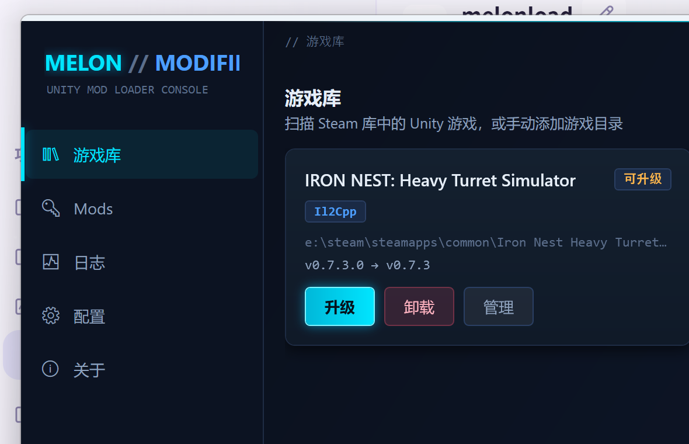
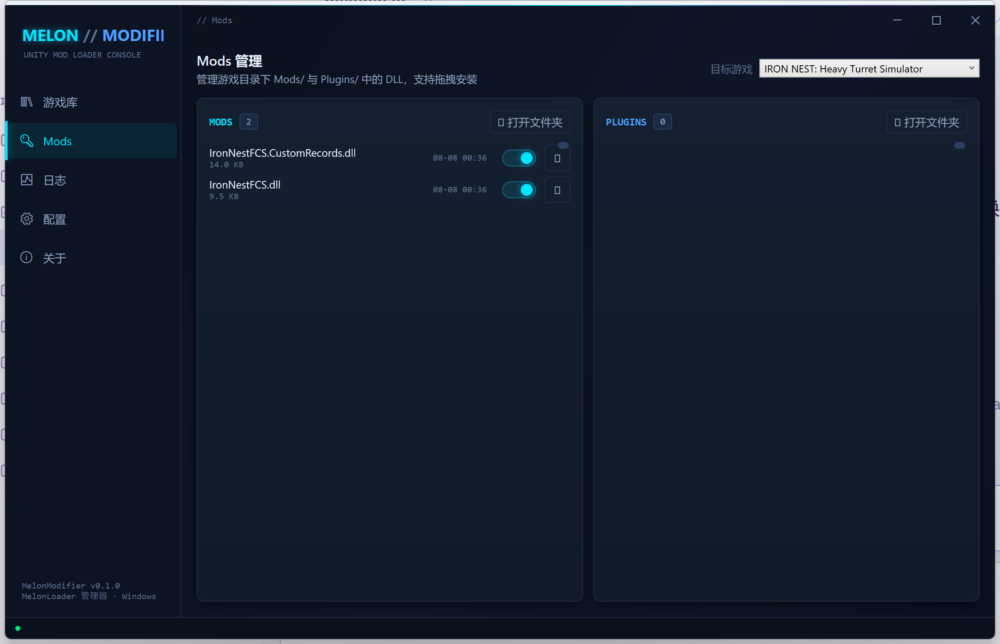
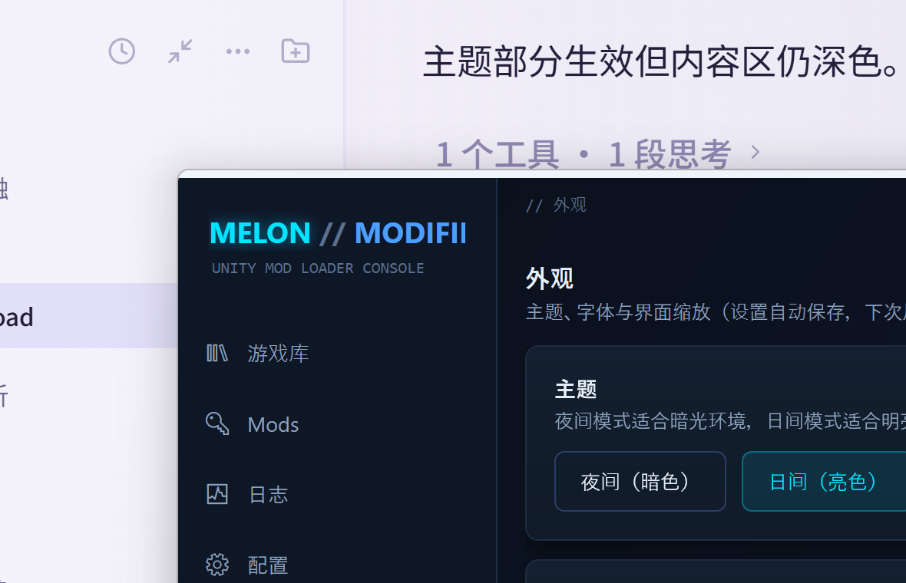

# MelonModifier

[English](README.en.md) | 中文

**Unity 游戏本地 Mod 管理器** —— 为 Unity 游戏安装、升级、卸载 [MelonLoader](https://github.com/LavaGang/MelonLoader) 与 [BepInEx](https://github.com/BepInEx/BepInEx)（Il2Cpp / Mono），管理本地 Mods 与 Plugins，查看运行日志与 `Loader.cfg` 配置。







## 文档

- [开发文档](docs/DEVELOPMENT.md) —— 架构、关键设计、踩坑记录
- [IRON NEST MOD 原理](docs/IRON-NEST-MOD-原理.md) —— MelonLoader MOD 开发原理（骨架 / IL2CPP 铁律 / 热重载架构 / 游戏数据速查）

## 功能

| 页面 | 功能 |
|------|------|
| **游戏库** | 扫描 Steam 库中的 Unity 游戏、手动添加目录、一键安装 / 升级 / 卸载 **MelonLoader** 或 **BepInEx**（按引擎自动选包）、引擎与版本状态检测（支持离线检测 + GitHub 最新版本比对，API 限流时自动回退固定版本） |
| **Mods** | 浏览 `Mods/` 与 `Plugins/` 中的 DLL，启停切换（`.disabled` 后缀）、删除、拖拽安装 |
| **日志** | 查看游戏 `MelonLoader/Logs/` 下的运行日志（崩溃排查） |
| **配置** | 编辑 `UserData/Loader.cfg`（全文模式，保留注释与未知键） |
| **外观** | 主题切换（夜间/日间）、字体族、界面缩放（85%~130%），设置自动保存 |
| **兼容性** | 41 款热门 Unity 游戏的 Mod 框架适配参考（引擎类型 + 推荐框架 + 生态备注） |
| **关于** | 版本与上游信息 |

## 支持的 Mod 框架

| 框架 | 引擎 | 版本 | 安装方式 |
|------|------|------|----------|
| **MelonLoader** | Il2Cpp / Mono | v0.7.x（GitHub latest） | `version.dll` 代理 + `MelonLoader/` 目录 |
| **BepInEx** | Mono | v5.4.23.5（稳定版） | `winhttp.dll` 代理 + `BepInEx/` 目录 |
| **BepInEx** | Il2Cpp | v6.0.0-pre.2（专用包，含 `dotnet/` BCL） | 同上（卸载按部署清单精确清理，不误删游戏文件） |

## 技术栈

- **C# / .NET 8（net8.0-windows）** + **WPF**（MVVM：CommunityToolkit.Mvvm）
- 核心逻辑与 UI 分离：`MelonModifier.Core`（纯 .NET，可单测）+ `MelonModifier.App`（WPF）
- 依赖：`Tomlyn`（TOML 解析 Loader.cfg）、`CommunityToolkit.Mvvm`
- 科幻 HUD 界面：深色霓虹主题（自定义控件模板，无第三方 UI 库）

## 快速开始

Windows 下双击根目录 `启动管理器.bat`（找不到程序时自动编译并启动）；或手动：

```bash
dotnet build MelonModifier.sln
dotnet run --project src/MelonModifier.App
```

数据目录：`%AppData%\MelonModifier`（手动添加的游戏列表 + 下载缓存）。

## 工作原理

MelonLoader 的"安装"本质是向游戏根目录写入：
- `version.dll` —— 代理 DLL，游戏启动时被 Windows DLL 搜索机制加载
- `MelonLoader/` —— 框架目录（含 net6/net472/net35 运行时）

卸载即删除上述两项（`Mods/`、`Plugins/`、`UserData/` 保留）。

## 已知限制

- 目前仅从 GitHub Releases 下载最新版（v0.7.x 结构：`version.dll` + `MelonLoader/`，无 `dobby.dll`）
- 版本比对为字符串比较（本地文件版本 `0.7.3.0` 与 tag `v0.7.3` 会视为可升级，实际重装幂等无害）
- 未接入 Thunderstore 在线 mod 库（本地管理）

## 后续规划

- MOD 开发工作流：生成 C# mod 模板项目 → 编译 → 一键部署到游戏 `Mods/`
- 语义化版本比较、安装备份恢复入口
